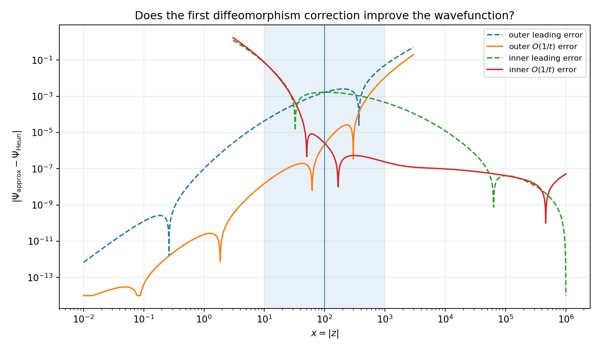
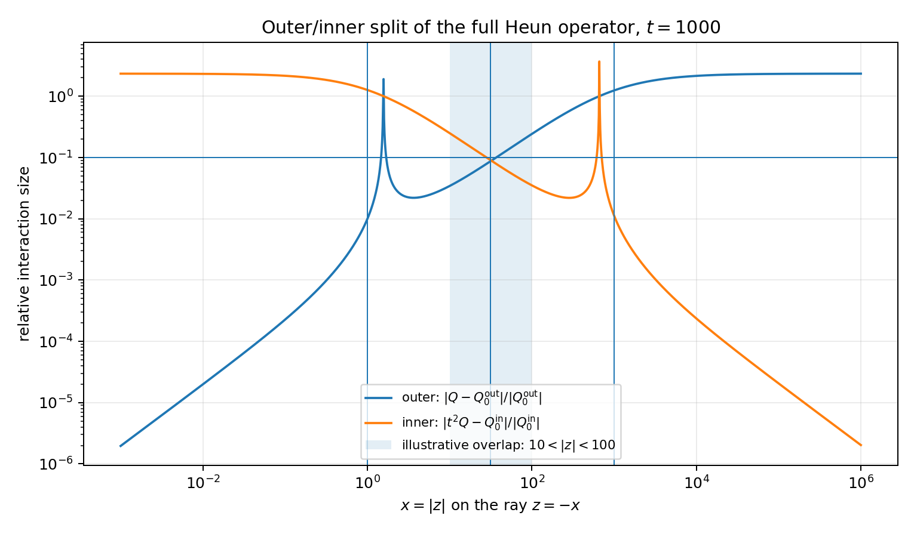
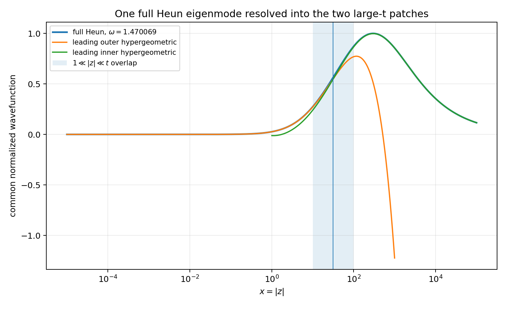
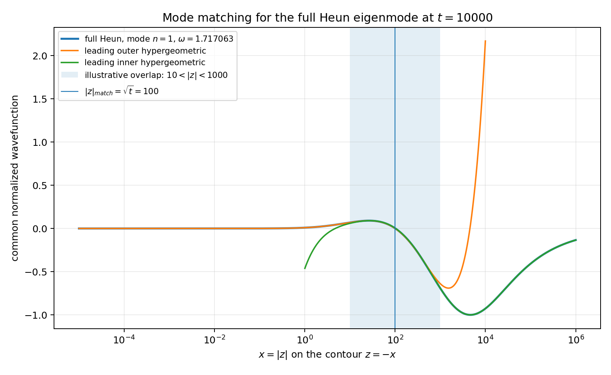
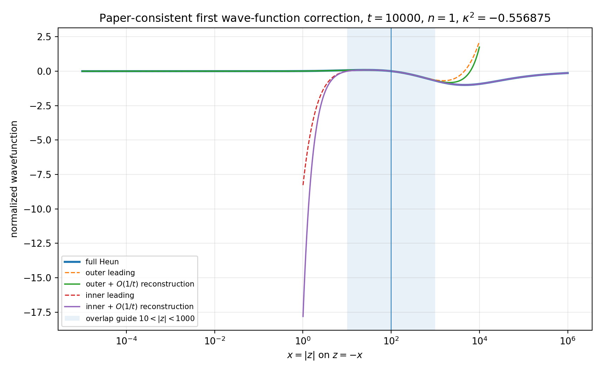

# Numerical Heun shooting and large-`t` hypergeometric matching

A reproducible collection of the numerical experiments developed around

> A. Cabo-Bizet, V. Dimitrov, D. Martelli and L. Ruggeri, **“Projecting Gravitational Fluctuations onto Near-Horizon Throats,”** arXiv:2608.00363 (2026).

Paper: https://arxiv.org/abs/2608.00363

## Main result

The repository numerically solves the full Heun equation by two-sided Frobenius shooting and tests its large-`t` decomposition into complementary outer and inner Gauss-hypergeometric problems.

The most important calculation is `experiments/04_first_correction`: at `t=10000`, using the accessory-parameter expansion consistent with our paper and its explicit first diffeomorphism correction of Sec. 3.5, the error in the reconstructed wave function near the central overlap scale `|z|=sqrt(t)=100` drops from roughly `10^-3` to a few `10^-6` in both patches — an improvement of several hundred-fold.



This realizes the finite-`t` smooth-transition numerical check we proposed in our paper's discussion.  It is a generic Heun precision test, **not yet a Kerr quasinormal-mode calculation**.

## Repository layout

```text
.
├── README.md
├── requirements.txt
├── run_all.py
├── docs/
│   ├── HIGH_PRECISION_TESTS.md
│   └── ASTROPHYSICS_OUTLOOK.md
├── references/
│   ├── README.md
│   └── paper.bib
└── experiments/
    ├── 01_basic_shooting/
    ├── 02_large_t_regions/
    ├── 03_t10000_mode_matching/
    └── 04_first_correction/
```

Each experiment includes its Python script and generated CSV, PNG, and PDF outputs.

## The large-`t` picture

Our paper's matching region is

```text
1 << z << t
```

(eq. 2.56).  On the numerical contour `z=-x`, this is represented as

```text
1 << |z| = x << t.
```

The outer solution is accurate when `|z|/t` is small; the inner solution uses `ζ=z/t` and becomes accurate once `|z|` is large compared with the outer singularity scale.  The overlap is parametrically broad at large `t`.



## Experiments

### 01 — baseline two-sided shooting

A real spectral demonstration at `t=2` using `u=-ω`.  It establishes Frobenius endpoint data, integration in `s=log x`, a normalized-Wronskian eigenvalue condition, and discrete eigenfunctions.

### 02 — outer/inner split at `t=1000`

Shows directly how the original `z` domain separates into the two asymptotic regions and how a full numerical eigenmode is covered by the two leading hypergeometric patches.



### 03 — wider overlap at `t=10000`

Uses another mode (`n=1`) to visualize the much broader overlap.  This remains an illustrative `u=-ω` family.



### 04 — first paper-consistent wave-function correction

Uses

```text
u = u0(kappa) + u1(kappa)/t
```

from eqs. (3.3)-(3.4), the first outer/inner diffeomorphisms from eqs. (3.21) and (3.23)-(3.24), and the inverse-diffeomorphism wave-function reconstruction of eq. (3.41).

For the selected second low mode at `t=10000`:

```text
kappa^2 = -0.556874971371
u        = -1.717062949900
```

At `|z|=100`:

```text
outer: 1.666e-3  -> 2.269e-6   (~734x improvement)
inner: 1.687e-3  -> 2.560e-6   (~659x improvement)
```



See [docs/HIGH_PRECISION_TESTS.md](docs/HIGH_PRECISION_TESTS.md) for details.

## Astrophysical potential

In our paper, we apply the construction to near-extremal Kerr-de Sitter and Kerr-anti-de Sitter perturbations, where the full radial Heun problem splits into near-horizon and outer hypergeometric descriptions with Robin matching data.  The same framework is relevant to precise near-extremal mode spectra, Green functions/connection coefficients, possible low-temperature instabilities, and potential post-Minkowskian/post-Newtonian gravitational-wave applications, as we discuss in our paper.

The numerical work here is best viewed as a **validation platform** for that program.  To make astrophysical predictions, the next implementation must use our paper's actual Kerr-(A)dS map `a_i(ω),u(ω)`, complex frequency, physical horizon/asymptotic boundary conditions, and the angular separation problem.

See [docs/ASTROPHYSICS_OUTLOOK.md](docs/ASTROPHYSICS_OUTLOOK.md).

## Installation

Python 3.11+ is recommended.

```bash
python -m venv .venv
source .venv/bin/activate
pip install -r requirements.txt
```

The computations were produced in an environment with approximately

```text
numpy      2.3.5
scipy      1.17.0
matplotlib 3.10.8
```

## Reproducing the calculations

Run one experiment:

```bash
python run_all.py first-correction
```

or all four:

```bash
python run_all.py all
```

Individual scripts can also be run directly from their experiment directories.  Each writes its figures and CSV data to a local `output/` directory.

## Numerical conventions and limitations

- The demonstration contour is the negative real ray `z=-x`, `x>0`, which avoids crossing the finite singularities at `z=1` and `z=t` for real positive `t`.
- The first three experiments use illustrative real parameter slices and are not physical Kerr spectra.
- The fourth experiment is perturbatively consistent with our paper's `u(t)` construction through first order, but still uses fixed generic `a_i`, not the full Kerr-(A)dS frequency map.
- Overall wave-function normalization is arbitrary; comparisons remove irrelevant normalization shifts and focus on mode shape in the domain of validity of each patch.

## Citation

If this repository is used to study the method, please cite our paper above.  A BibTeX entry is included in `references/paper.bib`.
